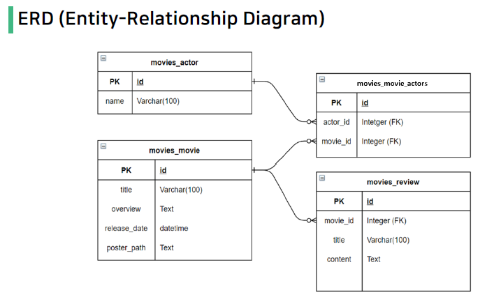

# DB 설계를 활용한 REST API 설계

## 목표

- DRF(Django Rest Framework)를 활용한 API Server 제작
- Database many to one relationship(1:N)에 대한 이해
- Database many to many relationship(M:N)에 대한 이해 

## 0. Base

- json 파일은 movies/fixtures/movies에 위치
- `$ python manage.py loaddata movies/actors.json movies/movies.json movies/reviews.json`
- 여러 파일일 경우 위와 같이 한 번에 받지 않고 하나씩 받는다면 순서 중요



- settings.py
```python
INSTALLED_APPS = [
    'movies',
    'rest_framework',
    ...
```
    - movies, rest_framework 등록

- urls.py
    - `path('project/', include('movies.urls')),`


## 1. movies/models.py
```python
class Movie(models.Model):
    actors = models.ManyToManyField(Actor, related_name='movies')
    title = models.CharField(max_length=100)
    overview = models.TextField()
    release_date = models.DateTimeField()
    poster_path = models.TextField()
```
- related_name 줘서 serializers.py에서 movies로 사용


## 2. movies/serializers.py
- views.py에서 `.objects.get(pk=pk)`로 단일 데이터 조회 시 `many=True` 설정 X
- `.objects.all()`로 모든 데이터 조회 시 `many=True`
- `read_only_fields`를 통해 외래 키 필드를 '읽기 전용 필드'로 설정
    - 해당 필드를 유효성 검사에서 제외시키고 데이터 조회 시에는 출력

  
  ```python
    # 단일 배우 정보 제공
  class ActorSerializer(serializers.ModelSerializer):
    # 출연 영화 제목을 포함하기 위해 중첩 
    # 영화는 여러 개이므로 many=True, 읽기 전용 read_only=True
    movies = MovieTitleSerializer(many=True, read_only=True)
    class Meta:
        model = Actor
        fields = '__all__'
  ```

- 이 때, MovieTitleSerializer를 사용할 것이기 때문에 상단에 MovieTitleSerializer 먼저 정의해줘야 한다!
  
  ```python
  class MovieTitleSerializer(serializers.ModelSerializer):
    class Meta:
        model = Movie
        fields = ('title', )
  ```
    - fields로 title만 가져오기 

review 모델에서는 FK로 movie 지정했으니까

```python
class ReviewSerializer(serializers.ModelSerializer):
    # movie는 단일 데이터이므로 many=True 설정 X
    # models.py에서 movie로 했으므로 movie
    movie = MovieTitleSerializer(read_only=True)
    class Meta:
        model = Review
        fields = ('id', 'movie', 'title', 'content', )
        read_only_fields = ('movie',)
        # 외래 키 필드를 읽기 전용 필드로 설정
```


## 3. movies/views.py
- `actors = Actor.objects.all()` 
    -> `serializer = ActorListSerializer(actors, many=True)`

- `actor = Actor.objects.get(pk=actor_pk)`
    -> `serializer = ActorSerializer(actor)`

- `if serializer.is_valid(raise_exception=True)`
    - 유효하지 않은 데이터에 대해 예외 발생시키기 
    - 유효성 검사 실패 시 기본적으로 HTTP 400 응답 반환

```python
@api_view(['GET'])
def actor_list(request):
    if request.method == 'GET':
        actors = Actor.objects.all()
        serializer = ActorListSerializer(actors, many=True)
        return Response(serializer.data)
    

@api_view(['GET'])
def actor_detail(request, actor_pk):
    actor = Actor.objects.get(pk=actor_pk)
    if request.method == 'GET':
        serializer = ActorSerializer(actor)
        return Response(serializer.data)
```

- 리뷰는 조회, 수정 삭제 -> GET / PUT / DELETE
```python
@api_view(['GET', 'PUT', 'DELETE'])
def review_detail(request, review_pk):
    review = Review.objects.get(pk=review_pk)
    if request.method == 'GET':
        serializer = ReviewSerializer(review)
        return Response(serializer.data)
    
    if request.method == 'PUT':
        serializer = ReviewSerializer(review, data=request.data)
        if serializer.is_valid(raise_exception=True):
            serializer.save()
            return Response(serializer.data)

    if request.method == 'DELETE':
        review.delete()
        return Response(status=status.HTTP_204_NO_CONTENT)
```

- 리뷰 작성 -> POST
```python
@api_view(['POST'])
def create_review(request, movie_pk):
    movie = Movie.objects.get(pk=movie_pk)
    serializer = ReviewSerializer(data=request.data)
    if serializer.is_valid(raise_exception=True):
        serializer.save(movie=movie)
        return Response(serializer.data, status=status.HTTP_201_CREATED)
```
    - save() 메서드는 특정 serializer 인스턴스를 저장하는 과정에서 추가적인 데이터를 받을 수 있음
    - ReviewSerializer를 통해 serialize되는 과정에서 parameter로 넘어온 movie_pk에 해당하는 movie 객체를 추가적인 데이터를 넘겨 저장