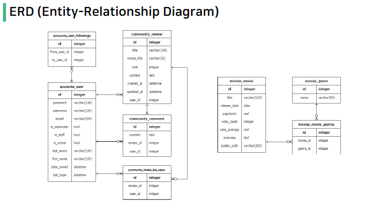

# 알고리즘을 적용한 서버 구성

## 목표

- 데이터를 생성, 조회, 수정, 삭제할 수 있는 Web Application 제작

- AJAX 통신과 JSON 구조에 대한 이해

- Database many to one relationship(N:1)에 대한 이해

- Database many to many relationship(M:N)에 대한 이해

- 영화 추천 알고리즘 설계




0. Base
- migrate 이후 `$ python manage.py loaddata movies.json`으로 loaddata 

- javascript 사용을 위해 base.html에 `block script` 만들기

- form 태그 사용시 밑이 아닌 옆으로 나란히 배열하기 -> `style="display:inline-block"` 
  

1. Accounts
### accounts/views.py
```python
from django.http import JsonResponse

# ...
@require_POST
def follow(request, user_pk):
    if request.user.is_authenticated:
        person = get_object_or_404(get_user_model(), pk=user_pk)
        user = request.user
        if person != user:
            if person.followers.filter(pk=user.pk).exists():
                person.followers.remove(user)
                is_followed = False
            else:
                person.followers.add(user)
                is_followed = True
            context = {
                'is_followed': is_followed,
                'followers_count': person.followers.count(),
                'followings_count': person.followings.count()
            }
            return JsonResponse(context)
        return redirect('accounts:profile', person.username)
    return redirect('accounts:login')
```

- `request.user.is_authenticated`를 통해 인증된 사용자만 팔로우 할 수 있도록 설정
- `if person != user`를 통해 자기 자신 팔로우 불가 
- 이미 팔로우 한 user라면 remove하고 `is_followed = False`로 바꾸기
- context에 follow 여부, follower/following count 저장 후 JsonResponse

### accounts/profile.html
```html
  <!-- block content -->
  
    <div>
      <form id="follow-form" data-user-id="{{ person.pk }}">
        
        
        <button type="submit">언팔로우</button>
        
        <button type="submit">팔로우</button>
        
      </form>
    </div>
  
```
- script에서 사용 위해 id 설정. POST 요청이므로 csrf_token 필수
- data-* attributes (사용자 지정 데이터)
  - `data-user-id`를 통해 사용자 지정 데이터 특성을 만들어 임의의 데이터를 HTML과 DOM 사이에서 교환할 수 있도록 한다. 
  - 특성 지정을 통해 js에서 `event.target.dataset.userId`로 접근 가능 

```javascript
  <script>
    const form = document.querySelector('#follow-form')
    const csrftoken = document.querySelector('[name=csrfmiddlewaretoken]').value

    form.addEventListener('submit', function(event) {
      event.preventDefault()

      const userId = event.target.dataset.userId
      console.log(userId)
      
      axios({
        method: 'POST',
        url: `/accounts/${userId}/follow/`,
        headers: {'X-CSRFToken': csrftoken},
      })
      .then((response) => {
        console.log(response.data)
        const isFollowed = response.data.is_followed
        const followBtn = document.querySelector('#follow-form > button')

        const followersCountTag = document.querySelector('#followers-count')
        const followingsCountTag = document.querySelector('#followings-count')

        const followersCount = response.data.followers_count
        const followingsCount = response.data.followings_count

        followersCountTag.innerText = followersCount
        followingsCountTag.innerText = followingsCount

        if(isFollowed === true) {
          followBtn.innerText = '언팔로우'
        } else {
          followBtn.innerText = '팔로우'
        }

      })
```
- axios 사용을 위한 첫줄 추가 
- AJAX로 csrftoken을 보내기 위해 csrftoken 선택 후 axios에서 headers로 넘겨주기 
- 좋아요 여부에 따른 followBtn의 text값 다르게 주기 
- views.py에서 context 작성 후 count해서 팔로잉/팔로워 수 보이도록 하기


2. Community
### community/views.py
```python
from django.http import JsonResponse

# ...
@require_POST
def like(request, review_pk):
    if request.user.is_authenticated:
        review = get_object_or_404(Review, pk=review_pk)
        user = request.user

        if review.like_users.filter(pk=user.pk).exists():
            review.like_users.remove(user)
            is_liked = False
        else:
            review.like_users.add(user)
            is_liked = True
        context = {
            'is_liked': is_liked,
            'like_count': review.like_users.count()
        }
        return JsonResponse(context)
    return redirect('accounts:login')

```

- 좋아요도 팔로우와 비슷하게 구성


3. Movies
### movies/views.py
```python
@require_safe
def index(request):
    movies = Movie.objects.all()
    context = {
        'movies': movies,
    }
    return render(request, 'movies/index.html', context)


@require_safe
def detail(request, movie_pk):
    movie = Movie.objects.get(pk=movie_pk)
    genre = movie.genres.all()
    context = {
        'movie': movie,
        'genres': genre,
    }
    return render(request, 'movies/detail.html', context)
```
- index에서는 `Movie.objects.all()`으로 모든 영화 정보 보여주기 
- detail에서는 `Movie.objects.get(pk=movie_pk)`로 해당 영화 정보 가져오기 
  - ManyToManyField로 장르 정보 가져오기 

### movies/index.html , detail.html
- for문 사용해서 모든 movies 제목 보여주기 
- 장르 역시 여러 개이므로 for문 사용. 이 때 p태그 내에서 for문 사용해서 장르 이름 모두 한 줄에 보여주기

### recommended - 알고리즘을 통한 영화 추천
- vote_average 내림차순. 평점 같은 경우 popularity 내림차순 기준 상위 10개의 영화 보여주기
  - views.py에서 `Movie.objects.all().order_by('-vote_average', '-popularity')[:10]`
  - context 통해 recommended.html로 넘겨주기 

- recommended.html에서 for문 사용해서 10개 영화 하나씩 보여주기
  - ```html
    
      
      <p>{{forloop.counter}}. <a href="">{{movie.title}}</a></p>
    
    ```
  - `forloop.counter` 사용하면 1부터 인덱스 번호 보여줄 수 있음
  - a태그 사용해서 영화 제목 누르면 디테일 페이지로 넘어가도록 만들기

- base.html에서 recommended 페이지로 넘어갈 수 있는 태그 만들기