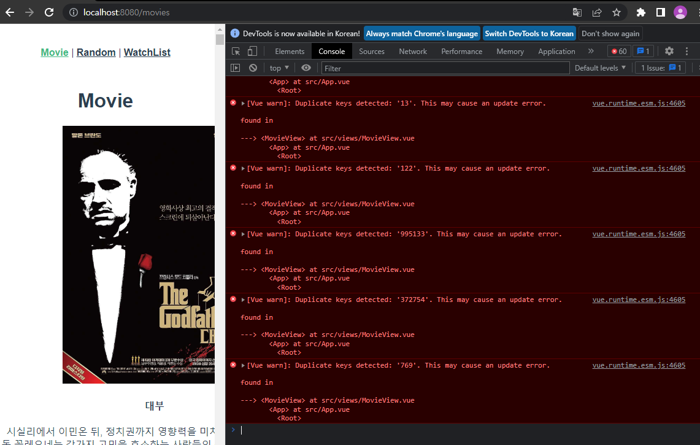

# Vue를 활용한 SPA 구성

## 목표

- 영화 정보를 제공하는 SPA 제작
- AJAX 통신과 JSON 구조에 대한 이해
- Vue CLI, Vue Router 플러그인 활용
0. Base
- `vue create my-vue-pjt`
- `vue add router`
- (vuex 사용 시) `vue add vuex`
- `cd my-vue-pjt`
- `npm run serve`


## router

### router/index.js

- View를 import한 후, routes 지정 

### App.vue

```html
<template>
  <div id="app">
    <nav>
      <router-link to="/movies">Movie</router-link> |
      <router-link to="/random">Random</router-link> |
      <router-link to="/watch-list">WatchList</router-link>
    </nav>
    <router-view/>
  </div>
</template>
```

- router-link를 통해 페이지 이동, router-view를 통해 보여줌


## [vuex 미사용]

### MovieView.vue

- axios 요청 받아온 res.data.results는 배열 형태이기 때문에 push가 아닌 `this.movielist = res.data.results`로 작성해야 한다. push로 할 경우 `for (const i of tmp)`를 통해 push를 해줘야 배열 안의 배열 형태로 들어가지 않는다.
- components에 있는 `MovieCard` import, components 등록, template에서 사용
  - v-for를 통해 movielist의 값들을 하나씩 넘겨주었다. 
- axios 요청 시 api_key, language, page는 params를 통해 넘겨주도록 하였다.
- `created()`를 통해 바로 영화 정보를 불러오도록 하였다.

### components/MovieCard.vue

- MovieView에서 넘겨준 Object 형태의 movie를 props.
- 이 때 movie의 poster_path는 바로 사용 불가하므로 앞에 주소를 추가하여야 한다.
  - ''(따옴표)가 아닌 ``(백틱) 사용 주의
- style에서 card-list와 그 안의 img css 지정하였다. 프로젝트 때 부트스트랩을 통해 card를 사용하면 수정할 것
  - 부트스트랩을 사용하기 위해서는 부트스트랩 설치 후 import

### RandomView.vue

- `getRandom()`을 통해 0부터 movielist길이까지의 범위 내에서 랜덤 인덱스 뽑아서 해당 인덱스의 값을 보여주도록 하였다.
  - 이 때, computed에 작성해야 배열이 생성된 후 random을 실행하기 때문에 에러가 뜨지 않음
  - lodash import 해야 함
- template에서 `{{getRandom?.title}}`처럼 ?(optional chaining)을 사용하면 값이 있을 때 출력해준다.

### WatchListView.vue

- `WatchListItem` import, components 등록, template에서 사용
  - v-for 사용하고, 이 때 key값으로 사용하기 위해 idx까지 작성
- createWatch 메서드를 통해 watchlist를 생성하는데, 이 때 if문을 통해 값을 입력하지 않으면 경고창이 뜨도록 하였다.
  - input에 값 입력 후 enter키를 누르거나, 버튼 클릭시 `createWatch` 실행

### components/WatchListItem.vue

- 해당 영화 이름 클릭 시 updateWatch 실행
  - `classList.toggle`을 통해 line이라는 클래스가 토글되도록 하였다.


## [vuex 사용]

- movieview와 randomview에서 각각 axios 요청하는 것이 아닌, index.js의 actions에서 axios 요청
- state의 movielist를 요청 받아온 리스트로 변경하는 것은 mutations에서 
  - actions에서 직접 수정하는 것이 아닌, actions에서는 commit 사용
- `getRandom()`은 state의 movielist를 사용하므로 getters에서
- view 파일에서 함수 호출할 때는 methods에서 정의하고, computed를 통해 store의 state 혹은 getters 접근
  - RandomView에서 getRandom을 실행하려면 computed에서 하여야 에러가 뜨지 않음.
    - 배열이 생성된 후에 다시 실행하기 때문
  - mapActions, mapGetters와 같은 Vuex Binding Helper를 사용하면 간편하다  


## Error



- getMovies를 페이지 누를 때마다 실행되기 때문에 기존 movielist에 axios 요청으로 받아온 데이터가 누적되어 movie.id가 중복된다.
  - 따라서 store/index.js의 mutations의 GET_MOVIES에서 push 하기 전에 `state.movielist = []`를 통해 state의 movielist를 초기화해야 한다.